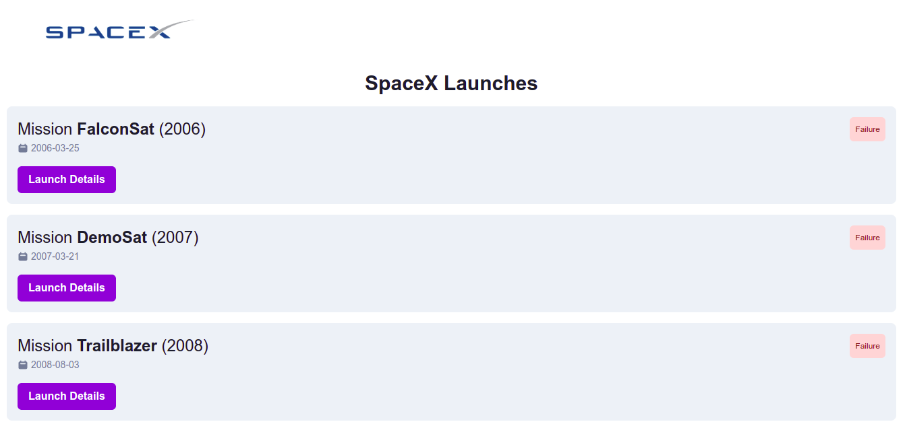

# SpaceX Missions

This is an application made in React that consumes the [SpaceX API](https://github.com/r-spacex/SpaceX-API).



## Setup

Be sure to be running Node.js v16.x or higher and npm v8.x or higher.

### Install dependencies

```bash
npm install
```

### Run the application

```bash
npm run dev
```

### Open the application

Open http://localhost:3000 to view it in the browser. The page will reload if you make changes to the source code.


### Build the application

```bash
npm run build
```

### Preview the application

```bash
npm run preview
```
